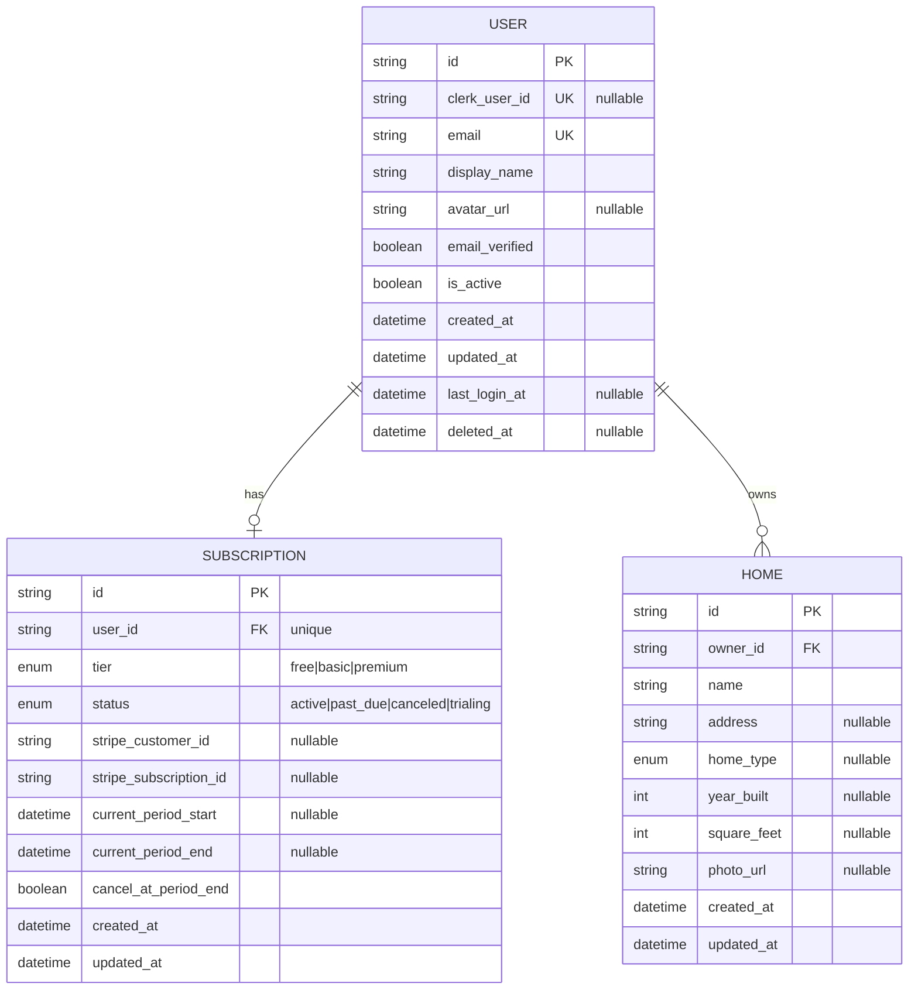
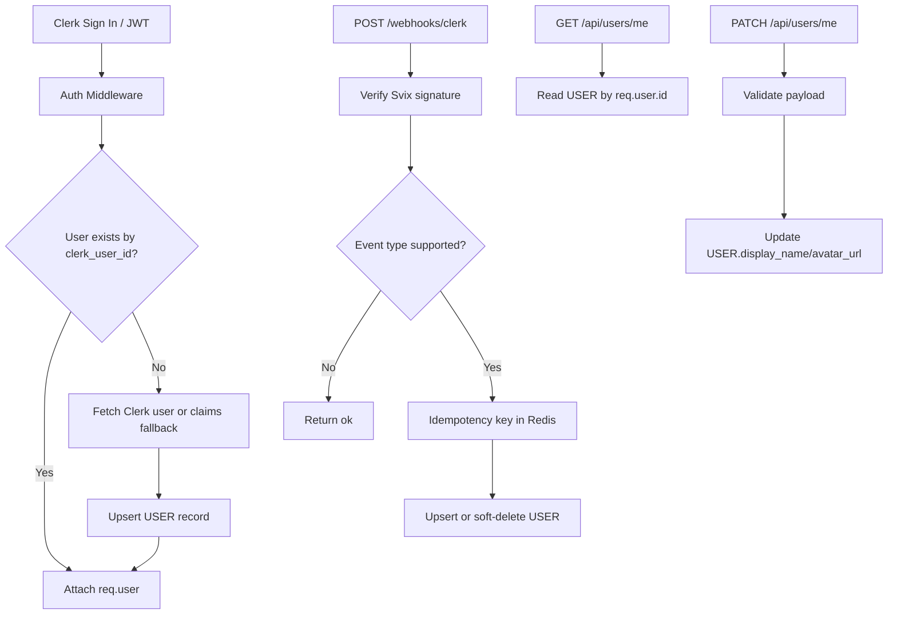

# Model Interactions (Mermaid)

This document describes how the current data models interact in the implemented backend.

## Entity Relationships

## Runtime Interaction Flow

## Notes

- `SUBSCRIPTION` and `HOME` are modeled in Prisma but do not yet have CRUD endpoints in the API.
- `USER` is the model currently mutated by auth sync, Clerk webhooks, and profile endpoints.
- Soft-delete behavior currently applies at the `USER` level (`is_active`, `deleted_at`).
